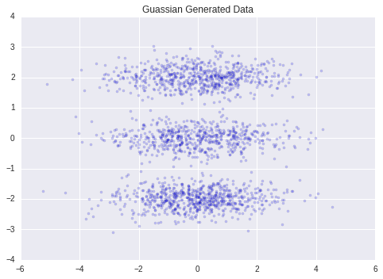
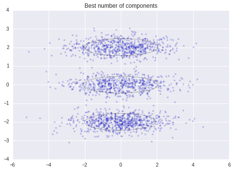
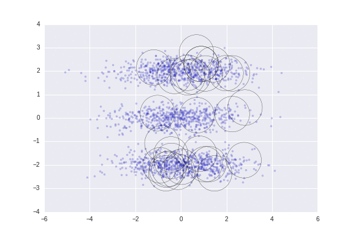

# Unsupervised Learning of Finite Gaussian Mixture Models

Original [paper](http://www.lx.it.pt/~mtf/IEEE_TPAMI_2002.pdf)

Unsupervised learning of gaussian mixture models uses a minimum message length like criterion to learn the optimal number of components in a finite gaussian mixture model. 

The usual way of estimating the optimal number of components in a finite mixture model falls into two classes: deterministic and stochastic. 

The deterministic methodology starts by obtaining a set of candidate models which is assumed to contain the true/optimal *k* (number of components) according to some model criterion. There are multiples criterion's to perform model selection when choosing the correct number of components while performing unsupervised clustering, e.g., Bayesian information criterion (BIC), Akaike information criterion (AIC), Minimum description length (MDL). Although these methods perform well, a major draw-back remains: a whole set of candidates models have to be obtained.

The stochastic and resampling methods make use Markov chain Monte Carlo to perform mixture inference in two different ways

## Installation

To install this python package:
```
pip install mml_gmm
```
This implementation is a port from the orginal authors [matlab](http://www.lx.it.pt/~mtf/mixturecode2.zip) code with small modifications and it is built as a sklearn wrapper. The dependencies are:
```
numpy
scipy
sklearn
```
To run the example scripts it also advisable to install `matplotlib`

An example jupyter notebook is provided [link](./notebooks/tutorial.ipynb)

## Usage

The following points were generated using three bivariate gaussian distributions. The clustering algorithm correctly converges to those distributions:

<p align="center">
   
  
</p>

It is also possible to visualize this process:

<p align="center"> 
  
</p>

## TODO

This code is a work in progress and it needs a lot of refactoring. It is supposed to be compatible with python2 and python3
